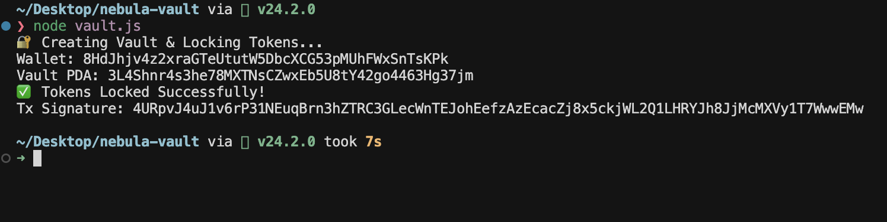

# 🔐 Nebula Token Vault — Devnet

This repository demonstrates creating a Token Vault on Solana Devnet and locking custom SPL tokens inside.

---

## 📌 Vault Information

| Field | Value |
|------|------|
| **Wallet Address** | `8HdJhjv4z2xraGTeUtutW5DbcXCG53pMUhFWxSnTsKPk` |
| **Vault PDA** | `3L4Shnr4s3he78MXTNsCZwxEb5U8tY42go4463Hg37jm` |

---

## ✅ Lock Transaction Details

| Field | Value |
|------|------|
| **Locked Token Amount** | 10 NEBULA Tokens |
| **Mint Address** | `Fa3JUK2dokFJZgjDyXa5dSpRhrBb8veoNnpbw9zvqgzr` |
| **Transaction Signature** | `4URpvJ4uJ1v6rP31NEuqBrn3hZTRC3GLecWnTEJohEefzAzEcacZj8x5ckjWL2Q1LHRYJh8JjMcMXVy1T7WwwEMw` |

View transaction on Solscan 👇  
https://solscan.io/tx/4URpvJ4uJ1v6rP31NEuqBrn3hZTRC3GLecWnTEJohEefzAzEcacZj8x5ckjWL2Q1LHRYJh8JjMcMXVy1T7WwwEMw?cluster=devnet

---

## 🖥️ Screenshot Proof

> ✅ Screenshot showing successful vault + lock transaction output

## 🖥️ Screenshot Evidence

